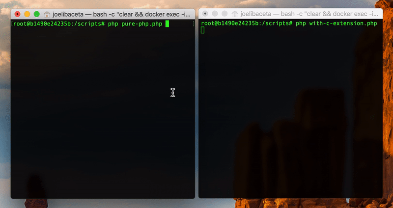

## PHP C Extension Demo

A performance approach

 

Primes generation is a frequent mathematical problem which needs to develop increasingly optimal algorithms, in this case we show two miller-rabin algorithm implementation strategies.

> [**Miller-Rabin**](https://en.wikipedia.org/wiki/Miller–Rabin_primality_test) is a probabilistic approch to determinate if a number is prime or not. 

 

The following demo, show us gpthis algoritm trying to find the first 5000 primes with 12 digits with each strategy.

  

